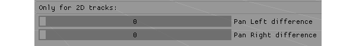

# Palmgine 3D
PalmGine-3D is a game engine that has been done for the [Game Engines](https://www.upc.edu/estudispdf/guia_docent.php?codi=804246&lang=ing) subject in the 3rd year of the [Game Design and Development](https://www.citm.upc.edu/ing/estudis/graus-videojocs/) grade of [CITM](https://www.citm.upc.edu/ing/) ([UPC](https://www.upc.edu/en?set_language=en)). It has been done in a four month period and tries to be a basic Unity like engine with one high level system.

The high level system we’ve chosen is the implementation of an audio engine called [Wwise]( https://www.audiokinetic.com/products/wwise/), so in this engine you are able to create audio listeners, audio sources and audio reverb zones to give audio to the games made with it.

## Team Members

### [Francisco Ruiz Giménez](https://github.com/botttos) (left member)

### [Manel Mourelo Montero](https://github.com/manelmourelo) (right member)

* LOG Console.
* Configuration Window.
* Panel Inspector with information about all the components of the selected GamObject.
* Quadtree to contain all the static GameObjects.
* Component Camera for GameObjects with camera culling.
* Editor camera.
* Window Resize.
* GameObject AABB.
* Time manager to play/pause/stop the in-game mode.
* Audio Listener component.
* Audio Source component.
* Audio Reverb Zone Component.

## Main Core Sub-Systems

### Module Scene
* Manage all the in the scene and the components attached to them.
* It allows you to save and load scenes (in binary format)

### File System
* Manage the folders used during the execution of the engine.

### Importer
* It allows you to import models and images and convert them into our own format.

### Time Manager
* It allows you to start, pause and stop the game-mode and controlls the deltatime of the objects in the scene.

### Resources Manager
* It avoid that you import repeated files.
* It has an “Asset” window that shows all user assets.

## Audio Sub-System
Audio sub-system uses [Wwise](https://www.audiokinetic.com/products/wwise/) to read and use the audio banks.

### Audio Listener

* This GameObject component allows you to set a GameObject as the listener of the scene.

### Audio Source
 

* This GameObject component is the one that reproduces the audios.

   

* It allows you to modify the clip you want it to reproduce.

 

* In case the clip has 2 audios attached to it you can set the time it will have to wait until it changes the audio.

 

* It allows you to play and stop the clip so you have a preview of how it will sound when you enter to the game-mode.

 

* It let's you mute the clip.

 

* It has the option to set the audio as PlayOnAwake, so it starts reproducing at the moment you enter to the game_mode.

 

* It lets you select the volume that the clip will have when it’s reproduced.

 

* It has the option to modify the pitch of the clip.

 

* If the clip is a 2D track it lets you choose the PAN of the audio.

 

* The audios can have a 3D positioning, so how they sound depends on where they are placed respect to the listener.

### Audio Reverb Zone
 

* This GameObject component allows you to create a zone (cube or sphere depending on users preference) that will affect the reverberation of the AudioSources that are inside it.

 

## Demo Video

Here you can see a short video showing PalmGine3D functionality.
<iframe width="560" height="315" src="https://www.youtube.com/embed/Q6bMaU0ab6Y" frameborder="0" allow="accelerometer; autoplay; encrypted-media; gyroscope; picture-in-picture" allowfullscreen></iframe>

If video is not showing properly click [here](https://www.youtube.com/watch?v=Q6bMaU0ab6Y). 

## Links
[Code Repository](https://github.com/botttos/PalmGine-3D)

[Latest Release](https://github.com/botttos/PalmGine-3D/releases)

## License
### Palmgine 3D is under the [Apache License 2.0](https://opensource.org/licenses/Apache-2.0)

#### Copyright (c) 2018 [Fran Ruiz Giménez](https://github.com/botttos) and [Manel Mourelo Montero](https://github.com/manelmourelo)

Permission is hereby granted, free of charge, to any person obtaining a copy
of this software and associated documentation files (the "Software"), to deal
in the Software without restriction, including without limitation the rights
to use, copy, modify, merge, publish, distribute, sublicense, and/or sell
copies of the Software, and to permit persons to whom the Software is
furnished to do so, subject to the following conditions:

The above copyright notice and this permission notice shall be included in all
copies or substantial portions of the Software.

THE SOFTWARE IS PROVIDED "AS IS", WITHOUT WARRANTY OF ANY KIND, EXPRESS OR
IMPLIED, INCLUDING BUT NOT LIMITED TO THE WARRANTIES OF MERCHANTABILITY,
FITNESS FOR A PARTICULAR PURPOSE AND NONINFRINGEMENT. IN NO EVENT SHALL THE
AUTHORS OR COPYRIGHT HOLDERS BE LIABLE FOR ANY CLAIM, DAMAGES OR OTHER
LIABILITY, WHETHER IN AN ACTION OF CONTRACT, TORT OR OTHERWISE, ARISING FROM,
OUT OF OR IN CONNECTION WITH THE SOFTWARE OR THE USE OR OTHER DEALINGS IN THE
SOFTWARE.
